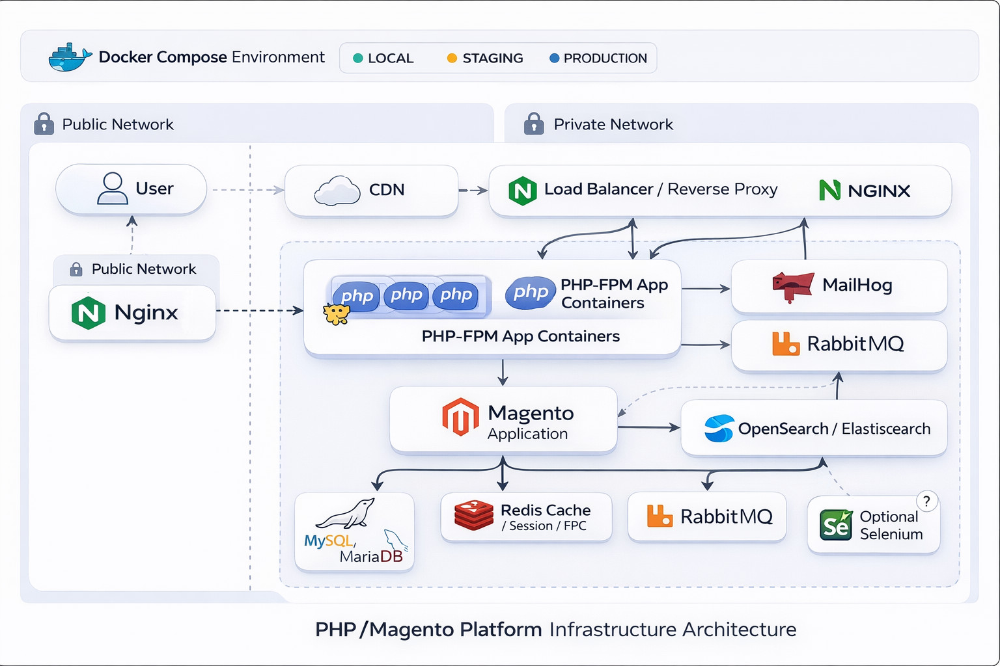

# 🚀 Phoenix-Launch-Silo
> *Making **First Contact** with production-ready **Docker** environments.*

Warp started as a tool to simplify development environments. The project is now evolving into a warp-powered shipyard of networks for productive development and deployment, with built-in analysis tooling.

##  Warp Architecture



## Features

### Infrastructure services

- Nginx
- PHP
- MySQL / MariaDB
- Redis / Valkey
- OpenSearch / Elasticsearch
- RabbitMQ
- MailHog
- Varnish
- Selenium
- PostgreSQL

### Operational tooling

- `warp deploy` for repeatable deploy flows
- `warp audit` for Magento-oriented code quality checks
- `warp agents` for private project automation lifecycle hooks
- `warp telemetry scan` for memory diagnostics and recommendations
- `warp db`, `warp cache`, `warp search` for capability-first operations
- `warp php --version` for runtime PHP inspection
- Sandbox mode for Magento 2 developer modules

## What Warp Is Good At

Warp is designed to help teams:

- bootstrap Docker-based PHP environments quickly
- operate project services with a consistent CLI
- support Magento-first development and deployment workflows
- run analysis and troubleshooting tasks without relying on ad-hoc scripts
- work with local, mixed, or partially external infrastructure setups

## Requirements

- Docker community edition
- `docker-compose >= 1.29` or Docker Compose plugin (`docker compose`)

## Installation

Run the following command in your project root:

```bash
curl -L -o warp https://raw.githubusercontent.com/magtools/phoenix-launch-silo/refs/heads/master/dist/warp
chmod 755 warp
```

## Command Line Update

Update the local Warp binary and framework with:

```bash
chmod 755 warp
./warp update 
```

## Quick Start

Initialize and start a project:

```bash
./warp init
./warp start
./warp info
```

Stop the environment when you are done:

```bash
./warp stop
```

## Core Commands

### Setup and runtime

| Command | Description |
| ------- | ----------- |
| `warp --help` | Show global help |
| `warp [command] --help` | Show command-specific help |
| `warp init` | Initialize Warp for the project |
| `warp start` | Start containers |
| `warp stop` | Stop containers |
| `warp ps` | Show containers with stable Warp columns |
| `warp info` | Show current project and service information |

### Operations

| Command | Description |
| ------- | ----------- |
| `warp deploy doctor` | Validate deploy prerequisites |
| `warp deploy run` | Run the configured deploy flow |
| `warp update` | Update Warp |
| `warp logs` | Inspect service logs |

### Analysis and diagnostics

| Command | Description |
| ------- | ----------- |
| `warp audit` | Run code quality audits |
| `warp audit risky --path <path>` | Search risky primitives on a specific path |
| `warp audit phpstan` | Run PHPStan using the default project scope |
| `warp telemetry scan` | Show memory usage and recommendations |
| `warp php --version` | Print the effective runtime PHP version |

### Service-oriented commands

| Command | Description |
| ------- | ----------- |
| `warp db` | Database operations |
| `warp cache` | Cache operations |
| `warp search` | Search engine operations |

## Common Workflows

### Run code analysis

```bash
./warp audit
./warp audit risky --path app/code/Vendor/Module
./warp audit phpstan
./warp audit phpcompat --path app/code/Vendor/Module
```

### Check runtime PHP version

```bash
./warp php --version
```

### Run a deploy

```bash
./warp deploy doctor
./warp deploy run
```

## Documentation

For more detailed functional documentation, see:

- [Warp Latest (ES)](features/warp-latest.md), [Warp Latest (EN)](features/warp-latest-en.md)
- [Warp Audit](features/warp-scan.md)
- [Warp Fallback](features/warp-fallback.md)
- [Warp Service Version](features/warp-service-version.md)

## Licensing

**warp engine framework** is licensed under the Apache License, Version 2.0.
See [LICENSE](LICENSE) for the full license text.

## Changelog

- Functional overview of recent improvements: [Warp Latest (ES)](features/warp-latest.md), [Warp Latest (EN)](features/warp-latest-en.md)
- Detailed historical changes: [CHANGES.md](CHANGES.md)

## Maintainer Information

Phoenix Launch Silo is an independent evolution of the Warp lineage. It is no longer the original Warp tool, and it now focuses on production-ready orchestration, deployment, and built-in analysis workflows.


Legacy credits from the old Warp project: [CREDITS.md](CREDITS.md)

### Warp Drive initialized: Transcending development to full-scale orchestration

```
  Out there... that way.   https://github.com/magtools/phoenix-launch-silo
```


```
    ___ ____     ____        _____
   ____      ___      ______      ___
        _  ___  __    ___        ____
  ____ | |     / /___ __________       ____
       | | /| / / __ `/ ___/ __ \ __    ___
  ____ | |/ |/ / /_/ / /  / /_/ / __  ___
   _   |__/|__/\__,_/_/  / .___/    ___   ____
    __   ___    ____    /_/  ___   __   __
        ____     ___   ____  __   ______
   ____      ___      ______    ____   ____

  WARP ENGINE - Speeding up! your development infraestructure
```
